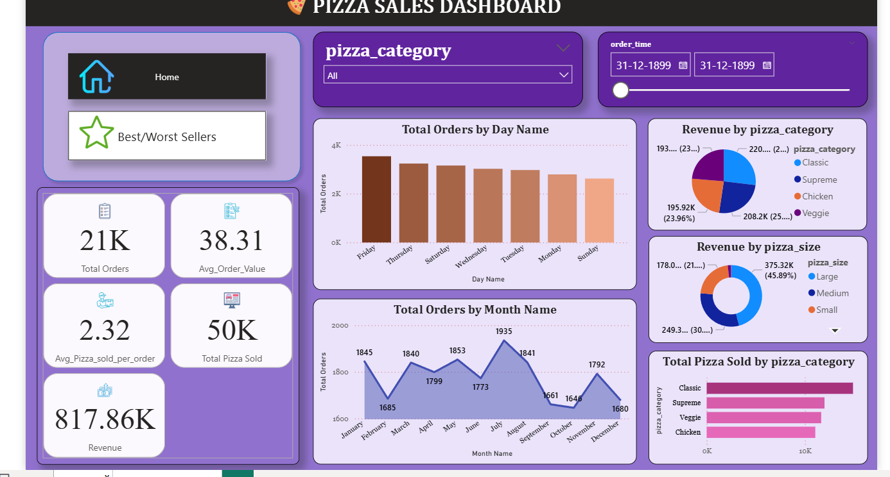
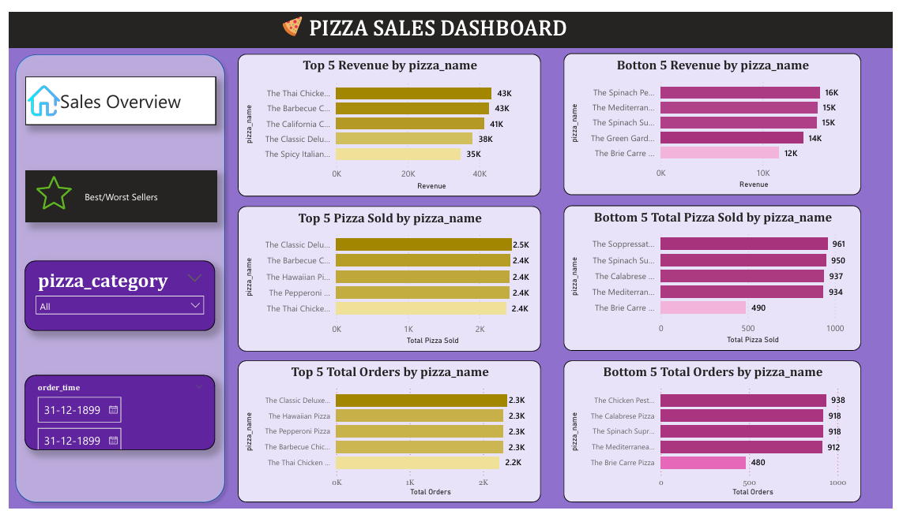

🍕 Pizza Sales Dashboard
A comprehensive Power BI dashboard for analyzing pizza sales data, including order trends, revenue metrics, product performance, and customer insights.

📊 Project Overview
This project contains an interactive Power BI dashboard (pizza_sales_dashboard.pbix) connected to a detailed sales dataset (pizza_sales.xlsx). The dashboard provides key business metrics and visualizations to track sales performance, identify trends, and support data-driven decision-making.

📁 Files Included
pizza_sales_dashboard.pbix - Power BI dashboard file with interactive visualizations and reports
pizza_sales.xlsx - Raw sales data in Excel format (48,620 records)

📈 Dataset Overview
The sales dataset contains 48,620 pizza orders with the following columns:
Column                  Description
pizza_id                Unique identifier for the pizza 
productorder_id         Unique identifier for the order
pizza_name_id           ID reference for pizza name
pizza_name              Name of the pizza product
pizza_category          Category/type of pizza
pizza_size              Size of pizza (S, M, L, XL, XXL)
pizza_ingredients       List of ingredients in the pizza
quantity                Number of pizzas ordered
order_date              Date of the order
order_time              Time of the order
unit_price              Price per pizza
total_price             Total price for the order

🎯 Key Features
Dashboard Visualizations
    1.Sales Overview - Total revenue, total orders, and average order value
    2.Sales Trends - Daily/monthly sales patterns and growth trends
    3.Product Performance - Top-selling pizzas by revenue and quantity
    4.Category Analysis - Sales breakdown by pizza category
    5.Size Distribution - Popular pizza sizes and their revenue contribution
    6.Order Metrics - Order volume, average order value, and peak hours

🛠️ Tools Used
This project is built using only two core tools:
    1.Microsoft Power BI - For creating interactive dashboards and visualizations
    2.Microsoft Excel - For storing and managing the raw sales data

Data Insights
    1.Revenue trends over time
    2.Best-performing pizza products
    3.Customer ordering patterns
    4.Seasonal sales variations
    5.Order timing analysis

📊 Dashboard Sections
Summary Page
    1.High-level KPIs (Total Revenue, Orders, Average Order Value)
    2.Revenue and order trends
    3.Top products at a glance

Detailed Analysis
    1.Category-wise sales breakdown
    2.Size distribution and performance
    3.Temporal analysis (by day, week, month)
    4.Product-level insights

Filters & Interactivity
    1.Filter by date range
    2.Filter by pizza category and size
    3.Drill-down capabilities for deeper insights
    4.Cross-filtering between visualizations

💡Insights & Recommendations
Based on typical pizza sales data, consider analyzing:
    1.Which pizza categories generate the most revenue
    2.Peak ordering times and days
    3.Seasonal trends and promotional opportunities
    4.Customer preferences for pizza sizes
    5.Product bundling opportunities
    6.Inventory management based on demand patterns

📸 Dashboard Preview

